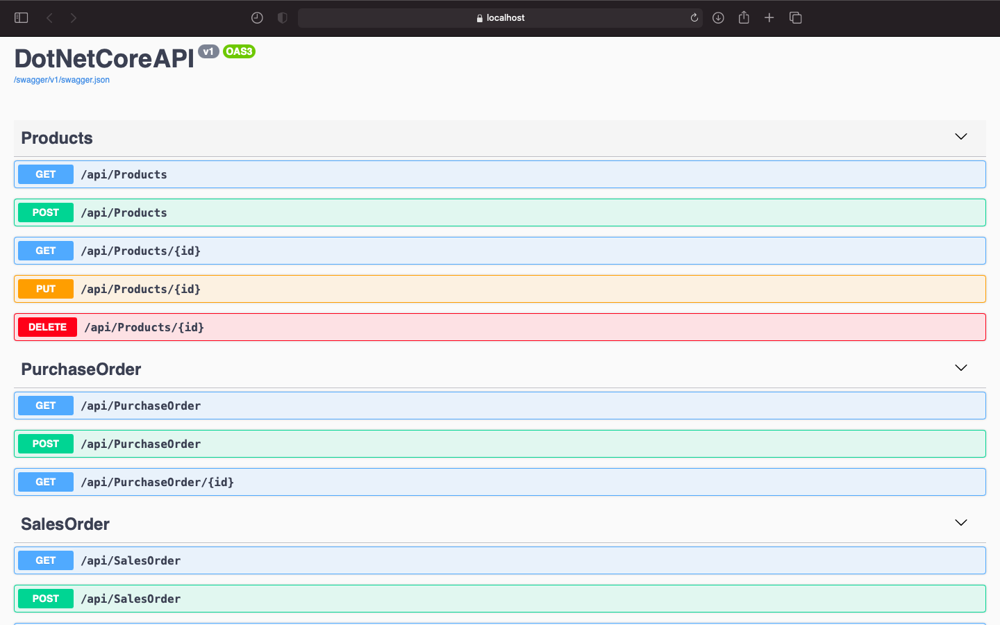
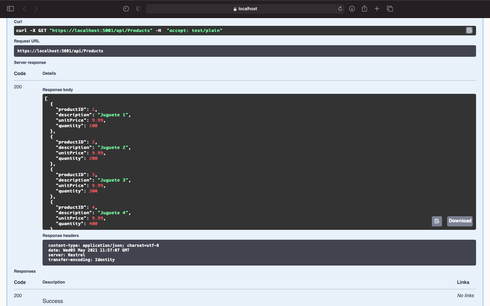
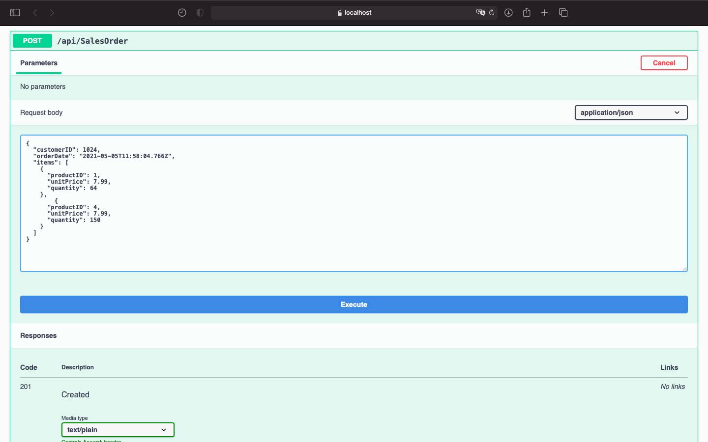

### EVALUACIÓN TÉCNICA FORZA

# Prueba específica: Backend

## José Antonio Herrera

Se incluye la implementación de una API REST para llevar el control de inventario.

## Tecnología utilizada:

- .NET Core 5.0.0
- Entity Framework
- Swagger (OpenAPI Specification) 3.0
- Sqlite: Se utiliza una instancia In-Memory

(No utilicé SQL Server debido a que uso una Mac)

## API

El servicio se ejecuta en https://localhost:5001/api

### Products

- GET /api/Products : Obtiene el inventario de productos
- POST /api/Products : Agrega un producto al inventario
- GET /api/Products/{id} : Obtiene un producto por Id
- PUT /api/Products/{id} : Modifica un producto existente
- DELETE /api/Products/{id} : Elimina un producto existente

### PurchaseOrder

- GET /api/PurchaseOrder : Obtiene el listado de compras
- POST /api/PurchaseOrder : Registra una compra y aumenta el stock de los productos incluidos
- GET /api/PurchaseOrder/{id} : Obtiene una orden de compra por Id

### SalesOrder

- GET /api/SalesOrder : Obtiene el listado de ventas
- POST /api/SalesOrder : Registra una venta y disminy¡uye el stock de los productos incluidos
- GET /api/SalesOrder/{id} : Obtiene una orden de venta por Id

La API está detallada en la documentación generada automáticamente por Swagger:
https://localhost:5001/swagger/index.html

Desde esta interfaz se puede consumir el servicio.

